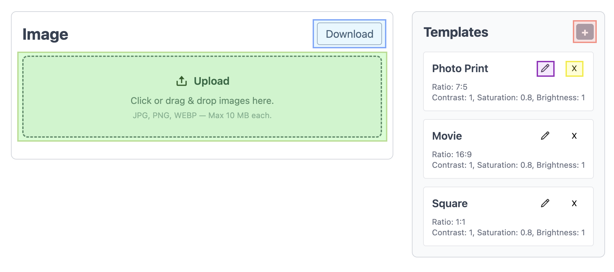
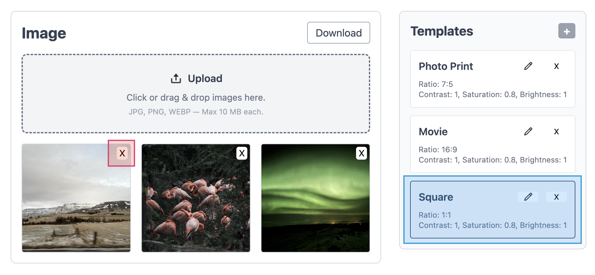

Clone the repository and go into the project directory. 

Run `npm install` to install dependencies. Once it’s done, open your browser and visit [http://localhost:5173/](http://localhost:5173/)  to start using the tool.

Keep in mind, refreshing the browser will clear all your uploaded images and templates. This tool is still a work in progress, built for personal use.

I had a lot of fun building it with the help of my AI assistant (argued with it like a crazy person hahahaha). But honestly, I’m happy with the final result. So, thank you, ChatGPT.

Okay, so, how to use it? It's super simple :)

As shown in the screenshots, the green section is where you upload your images. You can click the area to select files from your device, or simply drag and drop them into the box.

After applying templates, you can download all processed images as a single `.zip` file by clicking the `Download` button located in the blue section.

Use the "+" button to add new templates. In the purple and yellow areas, you can edit or delete existing templates. 

To remove any uploaded image, click the small "x" on its preview.

Click a template card once to apply its effects to your images, or click it again to cancel and revert to the original look.

Inside the template editing page, adjust contrast, saturation, brightness, and ratio as needed. remember to save your changes before leaving.